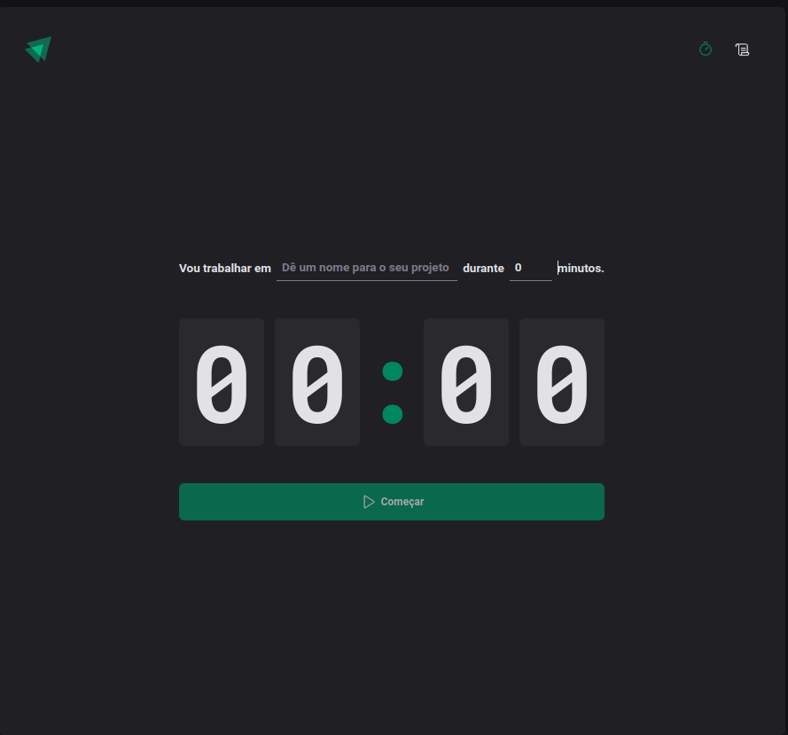

<h1 align="center">
  Ignite Timer
</h1>

<div align="center">

</div>

## About

⏳ ignite Timer - Counter to use with Pomodoro technique.

Project developed during the ReactJS Ignite Course from [Rocketseat](https://www.rocketseat.com.br/ignite).

---

## Features

- [x] Create a timer
- [x] Interrupt timer
- [x] Log timer history
- [x] Persist data in local storage

---

## How it works

### Pre-requisites

Before you begin, you will need to have the following tools installed on your machine:
[Git](https://git-scm.com), [Node.js](https://nodejs.org/en/).
In addition, it is good to have an editor to work with the code like [VSCode](https://code.visualstudio.com/)

#### Running

```bash

# Clone this repository
$ git clone git@github.com:ThiLourenco/ignite-timer.git

# Access the project folder in your terminal
$ cd ignite-timer

# Install the dependencies
$ npm install

# Run the application in development mode
$ npm run dev

# The app will open on the port: 5173 - go to http://localhost:5173/

```

---

## Technology

- **[React](https://reactjs.org/)**  
- **[TypeScript](https://www.typescriptlang.org/)**
- **[Phosphor Icons](https://phosphoricons.com/)**
- **[date-fns](https://date-fns.org/)**
- **[Vite](https://vitejs.dev/)**
- **[React Router](https://v5.reactrouter.com/web/guides/quick-start)**
- **[Immer](https://immerjs.github.io/immer/)**
- **[Styled Components](https://styled-components.com/)**
- **[Zod](https://zod.dev/)**
- **[React Hook Form](https://react-hook-form.com/)**